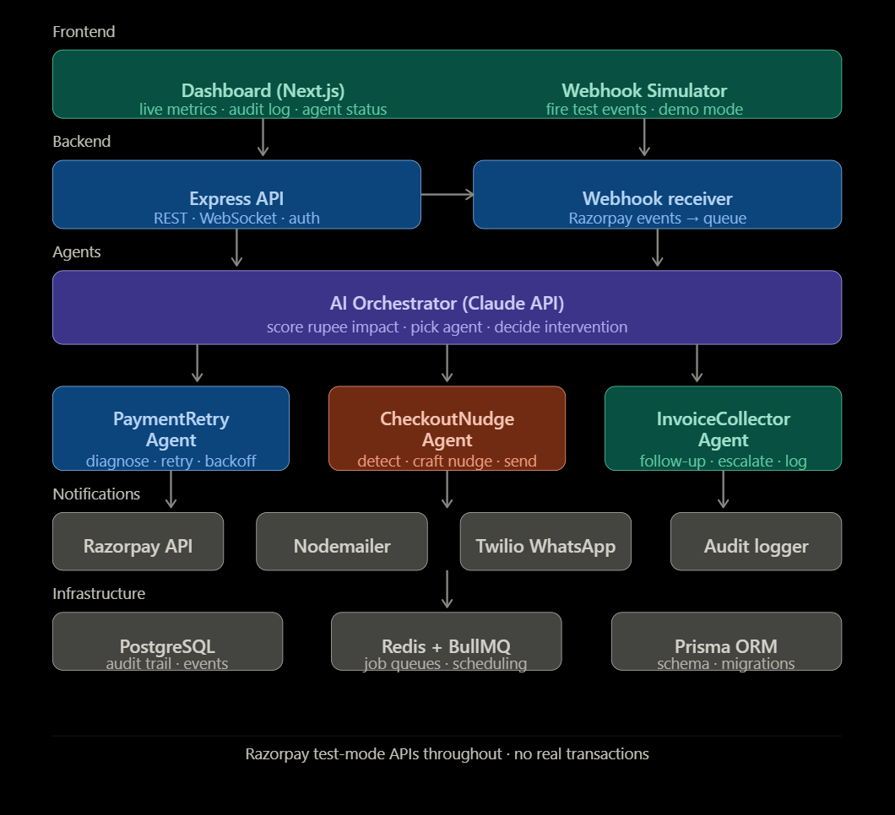

<div align="center">


# RevenueRadar

**Multi-agent AI system for revenue leakage detection and recovery**

[Overview](#overview) · [How It Works](#how-it-works) · [Architecture](#architecture) · [Tech Stack](#tech-stack) · [Project Structure](#project-structure) · [Getting Started](#getting-started) · [Safety Bounds](#safety-bounds)

Built for the Razorpay AI Buildathon.

</div>

---

## Overview

Revenue rarely disappears in one step — it leaks, across several surfaces at once. A card payment fails silently. A checkout is abandoned before the last step. An invoice goes unpaid for weeks. Handled separately, each of these is a minor operational task. Left unmonitored, together they compound into real, ongoing revenue loss.

RevenueRadar watches all three surfaces continuously, scores every detected event by rupee impact and recovery probability, and dispatches a purpose-built recovery agent for each case — within strict, auditable limits.

| Surface | Problem | Recovery Agent |
| --- | --- | --- |
| Failed Payments | Recurring or one-time payments failing due to transient card or network issues | `PaymentRetryAgent` |
| Abandoned Checkouts | Customers dropping off before completing checkout | `CheckoutNudgeAgent` |
| Overdue Invoices | B2B invoices going unpaid past their due date | `InvoiceCollectorAgent` |

---

## How It Works

1. **Detect** — Razorpay webhooks for `payment.failed`, checkout abandonment, and invoice overdue events are received, verified, and normalized into a common `LeakageEvent` type.
2. **Triage** — An AI orchestrator, backed by the Claude API, scores each event by rupee amount at risk, recovery probability, and time decay, then selects the appropriate recovery agent.
3. **Dispatch** — The selected agent acts under hard-coded stopping rules: capped retry counts, cooldown windows, and a minimum confidence threshold below which the event is escalated to a human instead of acted on.
4. **Recover** — Agents execute recovery actions against Razorpay test-mode APIs and send customer notifications by email or WhatsApp.
5. **Audit** — Every decision and action is written to an immutable audit trail before execution, giving a full record of what was detected, why an action was chosen, and what happened.

---

## Architecture

<div align="center">

</div>

> An editable version of this diagram lives at [`docs/architecture.excalidraw`](docs/architecture.excalidraw) — open it in [Excalidraw](https://excalidraw.com) (Open → File) or the Excalidraw VS Code extension for the interactive version.

---

## Tech Stack

| Layer | Technology |
| --- | --- |
| Runtime | Node.js 20, TypeScript (strict mode) |
| Backend | Express.js |
| AI Orchestrator | Claude API |
| Queueing | BullMQ, backed by Redis |
| Database | PostgreSQL, accessed via Prisma ORM |
| Notifications | Nodemailer (email), Twilio (WhatsApp) |
| Frontend | Next.js (App Router), Tailwind CSS |
| Payments | Razorpay test-mode APIs |
| Validation | Zod |
| Logging | Winston |

---

## Project Structure

```
revenue-radar/
├── apps/
│   ├── api/            Express backend, orchestrator, and agents
│   │   └── src/
│   │       ├── agents/         PaymentRetryAgent, CheckoutNudgeAgent, InvoiceCollectorAgent
│   │       ├── orchestrator/   Claude-driven event triage
│   │       ├── queues/         BullMQ queue and worker definitions
│   │       ├── routes/         Webhook receiver, events, audit endpoints
│   │       ├── services/       Razorpay, notification, and audit services
│   │       ├── middleware/
│   │       └── config/
│   └── web/             Next.js dashboard
│       └── app/
│           ├── page.tsx         Overview
│           ├── events/          Live event feed
│           ├── audit/           Audit trail
│           └── simulate/        Webhook simulator
├── packages/
│   └── shared/          Shared types and constants
├── prisma/
│   └── schema.prisma
├── docker-compose.yml
└── .env.example
```

---

## Getting Started

### Prerequisites

- Node.js 20 or higher
- Docker (for PostgreSQL and Redis)
- A Razorpay test-mode account
- An Anthropic API key

### Installation

```bash
git clone https://github.com/abhishekck31/RevenueRadar.git
cd RevenueRadar
npm install
```

### Configure environment

```bash
cp .env.example .env
```

Fill in `RAZORPAY_KEY_ID`, `RAZORPAY_KEY_SECRET`, `RAZORPAY_WEBHOOK_SECRET`, `ANTHROPIC_API_KEY`, and the notification (SMTP, Twilio) credentials.

### Start infrastructure

```bash
docker compose up -d
npm run db:push
```

### Run the app

```bash
npm run dev
```

The API starts on `localhost:3001`, the dashboard on `localhost:3000`.

---

## Safety Bounds

RevenueRadar's agents operate under fixed limits that cannot be bypassed at runtime:

- `PaymentRetryAgent` — maximum 3 retries per payment, minimum 30 minutes between attempts
- `CheckoutNudgeAgent` — maximum 2 nudges per abandoned checkout, 2-hour cooldown
- `InvoiceCollectorAgent` — maximum 5 follow-ups, escalates to a human after 3 unanswered
- Any triage decision with confidence below 0.6 is escalated to a human rather than executed
- Every action is written to the audit trail before it runs

---

<div align="center">
<sub>Most tools solve one leak. RevenueRadar maps the whole pipe.</sub>
</div>
