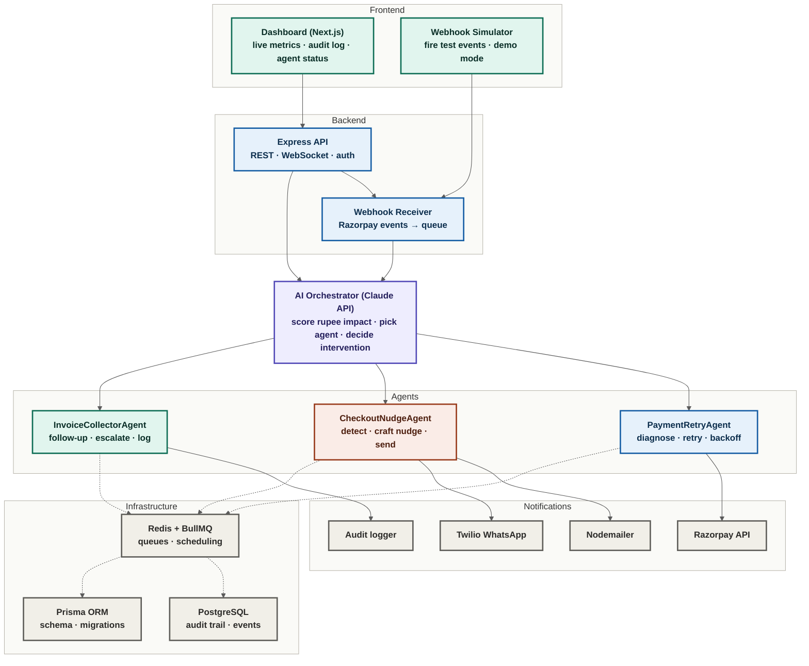

<div align="center">

[Overview](#overview) · [Architecture](#architecture) · [Quick Start](#quick-start) · [Merchant Setup](#merchant-setup) · [Stack](#stack) · [Safety & Bounds](#safety--bounds)

</div>

---

<div align="center"> 


# RevenueRadar

**Multi-agent AI system for revenue leakage detection and recovery**

[Overview](#overview) · [How It Works](#how-it-works) · [Architecture](#architecture) · [Tech Stack](#tech-stack) · [Project Structure](#project-structure) · [Quick Start](#quick-start) · [Safety Bounds](#safety-bounds)

Built for the Razorpay AI Buildathon.

</div>

---

<a name="overview"></a>
## Overview

Revenue rarely disappears in one step — it leaks, across several surfaces at once. A card payment fails silently. A checkout is abandoned before the last step. An invoice goes unpaid for weeks. Handled separately, each of these is a minor operational task. Left unmonitored, together they compound into real, ongoing revenue loss.

RevenueRadar watches all three surfaces continuously, scores every detected event by rupee impact and recovery probability, and dispatches a purpose-built recovery agent for each case — within strict, auditable limits.

| Surface | Problem | Recovery Agent |
| --- | --- | --- |
| Failed Payments | Recurring or one-time payments failing due to transient card or network issues | `PaymentRetryAgent` |
| Abandoned Checkouts | Customers dropping off before completing checkout | `CheckoutNudgeAgent` |
| Overdue Invoices | B2B invoices going unpaid past their due date | `InvoiceCollectorAgent` |

---

## How It Works

1. **Detect** — Razorpay webhooks for `payment.failed`, checkout abandonment, and invoice overdue events are received, verified, and normalized into a common `LeakageEvent` type.
2. **Triage** — An AI orchestrator, backed by the Claude API, scores each event by rupee amount at risk, recovery probability, and time decay, then selects the appropriate recovery agent.
3. **Dispatch** — The selected agent acts under hard-coded stopping rules: capped retry counts, cooldown windows, and a minimum confidence threshold below which the event is escalated to a human instead of acted on.
4. **Recover** — Agents execute recovery actions against Razorpay test-mode APIs and send customer notifications by email or WhatsApp.
5. **Audit** — Every decision and action is written to an immutable audit trail before execution, giving a full record of what was detected, why an action was chosen, and what happened.

---

<a name="architecture"></a>
## Architecture

The source lives at [`docs/architecture.mmd`](docs/architecture.mmd) — paste it into [Excalidraw](https://excalidraw.com)'s Mermaid-to-Excalidraw tool (the diagram icon in the left toolbar) for a fully editable native Excalidraw version.



---

<a name="stack"></a>
## Tech Stack

| Layer | Technology |
| --- | --- |
| Runtime | Node.js 20, TypeScript (strict mode) |
| Backend | Express.js |
| AI Orchestrator | Claude API |
| Queueing | BullMQ, backed by Redis |
| Database | PostgreSQL, accessed via Prisma ORM |
| Notifications | Nodemailer (email), Twilio (WhatsApp) |
| Frontend | Next.js (App Router), Tailwind CSS |
| Payments | Razorpay test-mode APIs |
| Validation | Zod |
| Logging | Winston |

---

## Project Structure

```
revenue-radar/
├── apps/
│   ├── api/            Express backend, orchestrator, and agents
│   │   └── src/
│   │       ├── agents/         PaymentRetryAgent, CheckoutNudgeAgent, InvoiceCollectorAgent
│   │       ├── orchestrator/   Claude-driven event triage
│   │       ├── queues/         BullMQ queue and worker definitions
│   │       ├── routes/         Webhook receiver, events, audit endpoints
│   │       ├── services/       Razorpay, notification, and audit services
│   │       ├── middleware/
│   │       └── config/
│   └── web/             Next.js dashboard
│       └── app/
│           ├── page.tsx         Overview
│           ├── events/          Live event feed
│           ├── audit/           Audit trail
│           └── simulate/        Webhook simulator
├── packages/
│   └── shared/          Shared types and constants
├── prisma/
│   └── schema.prisma
├── docker-compose.yml
└── .env.example
```

---

<a name="quick-start"></a>
## Quick Start

**Prerequisites:** Node.js 20+, Docker

```bash
# 1. Clone
git clone https://github.com/abhishekck31/revenue-radar
cd revenue-radar

# 2. Setup (installs deps, starts DB, seeds data)
make setup

# 3. Add your API keys to .env
# Required: RAZORPAY_KEY_ID, RAZORPAY_KEY_SECRET, ANTHROPIC_API_KEY
# Optional for full demo: SMTP_*, TWILIO_*
nano .env

# 4. Start development
make dev

# Open:
# Dashboard → http://localhost:3000
# API       → http://localhost:3001
# DB Studio → npx prisma studio
```

**Or run everything in Docker:**
```bash
make docker
```

`make` not installed (e.g. on Windows without WSL)? Run the underlying commands directly — see the [Makefile](Makefile).

---

<a name="safety--bounds"></a>
## Safety Bounds

RevenueRadar's agents operate under fixed limits that cannot be bypassed at runtime:

- `PaymentRetryAgent` — maximum 3 retries per payment, minimum 30 minutes between attempts
- `CheckoutNudgeAgent` — maximum 2 nudges per abandoned checkout, 2-hour cooldown
- `InvoiceCollectorAgent` — maximum 5 follow-ups, escalates to a human after 3 unanswered
- Any triage decision with confidence below 0.6 is escalated to a human rather than executed
- Every action is written to the audit trail before it runs

---

<div align="center">
<sub>Most tools solve one leak. RevenueRadar maps the whole pipe.</sub>
</div>

---

<a name="merchant-setup"></a>
## Merchant Setup Guide

> Connect your Razorpay account and start recovering revenue automatically.
> Setup takes under 15 minutes.

---

### Prerequisites

- A Razorpay account (test or live mode)
- RevenueRadar running locally or deployed
- Node.js 20+ and Docker installed

---

### Step 1 — Clone and start RevenueRadar

```bash
git clone https://github.com/abhishekck31/RevenueRadar
cd RevenueRadar
make setup
make dev
```

Dashboard → http://localhost:3000
API → http://localhost:3001

---

### Step 2 — Add your Razorpay API keys

Open `.env` and fill in your Razorpay test credentials:

```bash
# Get from: https://dashboard.razorpay.com/app/keys
# Make sure TEST MODE is on (toggle top-right in Razorpay dashboard)

RAZORPAY_KEY_ID=rzp_test_xxxxxxxxxxxx
RAZORPAY_KEY_SECRET=your_key_secret_here
RAZORPAY_WEBHOOK_SECRET=create_a_strong_random_string_here
```

Restart after saving:
```bash
make stop && make dev
```

---

### Step 3 — Expose your local server

Razorpay needs a public URL to deliver webhook events to your machine.

```bash
# Install ngrok
npm install -g ngrok

# Expose your API
ngrok http 3001
```

You'll see:
```
Forwarding  https://abc123.ngrok-free.app → http://localhost:3001
```

Copy the `https://` URL — you'll need it in the next step.

> Keep this terminal open. The URL changes every time ngrok restarts.

---

### Step 4 — Register the webhook on Razorpay

1. Go to [Razorpay Dashboard](https://dashboard.razorpay.com) → **Settings** → **Webhooks**
2. Click **+ Add New Webhook**
3. Fill in:

| Field | Value |
|---|---|
| Webhook URL | `https://abc123.ngrok-free.app/webhook/razorpay` |
| Secret | Same string as `RAZORPAY_WEBHOOK_SECRET` in `.env` |
| Alert Email | your@email.com |

4. Enable these events:

```
✅ payment.failed
✅ payment_link.expired
✅ invoice.expired
✅ subscription.halted
✅ subscription.cancelled
```

5. Click **Create Webhook**

---

### Step 5 — Add notification credentials

**Email — Mailtrap (free, catches emails without delivering to real inboxes)**

1. Sign up at [mailtrap.io](https://mailtrap.io)
2. Go to **Email Testing** → **Inboxes** → your inbox → **SMTP Settings**
3. Add to `.env`:

```bash
SMTP_HOST=sandbox.smtp.mailtrap.io
SMTP_PORT=2525
SMTP_USER=your_mailtrap_user
SMTP_PASS=your_mailtrap_pass
FROM_EMAIL=RevenueRadar <noreply@yourdomain.com>
```

**WhatsApp — Twilio sandbox**

1. Sign up at [twilio.com](https://twilio.com)
2. Go to **Messaging** → **Try it out** → **Send a WhatsApp message**
3. Join the sandbox from your phone using the join code
4. Add to `.env`:

```bash
TWILIO_ACCOUNT_SID=ACxxxxxxxxxxxxxxxx
TWILIO_AUTH_TOKEN=your_auth_token
TWILIO_WHATSAPP_FROM=whatsapp:+14155238886
```

---

### Step 6 — Fire your first real event

**Option A — Simulator (recommended)**

Go to http://localhost:3000/simulate and fire any event. No real Razorpay account needed.

**Option B — Real Razorpay test event**

| Event | How to trigger |
|---|---|
| `payment.failed` | Razorpay Dashboard → Payments → Create Test Payment → choose **Fail** at OTP screen |
| `invoice.expired` | Create invoice with yesterday's due date → save and send |
| `subscription.halted` | Create a subscription → cancel it from dashboard |

Test card: `4111 1111 1111 1111` · Expiry: any future · CVV: `123` · OTP: `1234`

---

### Step 7 — Watch it work

Open http://localhost:3000 and you should see:

- Event appear in **Live Events** table
- Pipeline animate step by step
- Agent dispatched with Claude's reasoning
- Recovery email land in your Mailtrap inbox
- Audit trail entry logged with full context

---

### Step 8 — Configure stopping rules (optional)

Edit `packages/shared/src/constants.ts`:

```typescript
export const STOPPING_RULES = {
  PAYMENT_RETRY: {
    maxRetries: 3,         // Max retry attempts per payment
    cooldownMinutes: 30,   // Min time between retries
  },
  CHECKOUT_NUDGE: {
    maxNudges: 2,          // Max nudges per abandoned checkout
    cooldownHours: 2,      // Min time between nudges
  },
  INVOICE_FOLLOWUP: {
    maxFollowups: 5,       // Max follow-ups per invoice
    escalateAfter: 3,      // Escalate to human after N unanswered
  },
  MIN_CONFIDENCE: 0.6      // Escalate if AI confidence below this
}
```

---

### Going to production

| Step | Action |
|---|---|
| Deploy | Railway, Render, or any VPS |
| Environment | Set `NODE_ENV=production` |
| Razorpay keys | Switch to live keys `rzp_live_...` |
| Webhook URL | Update to production domain on Razorpay dashboard |
| Email | Swap Mailtrap for SendGrid or AWS SES |
| WhatsApp | Apply for Twilio WhatsApp Business number |
| Start | Run `make docker` |

> ⚠️ Always test in Razorpay test mode first. Live mode triggers real payment operations.

---

### Troubleshooting

| Problem | Fix |
|---|---|
| Webhook not receiving events | Check ngrok is running · verify `RAZORPAY_WEBHOOK_SECRET` matches · check `make logs` |
| Emails not sending | Verify Mailtrap credentials · check Mailtrap inbox not real inbox |
| Agent not dispatching | Verify `ANTHROPIC_API_KEY` · check Redis: `redis-cli ping` → `PONG` |
| Dashboard showing no data | Run `make seed` · check Docker: `docker ps` |

---

<div align="center">
<sub>Most tools solve one leak. RevenueRadar maps the whole pipe.</sub>
</div>
