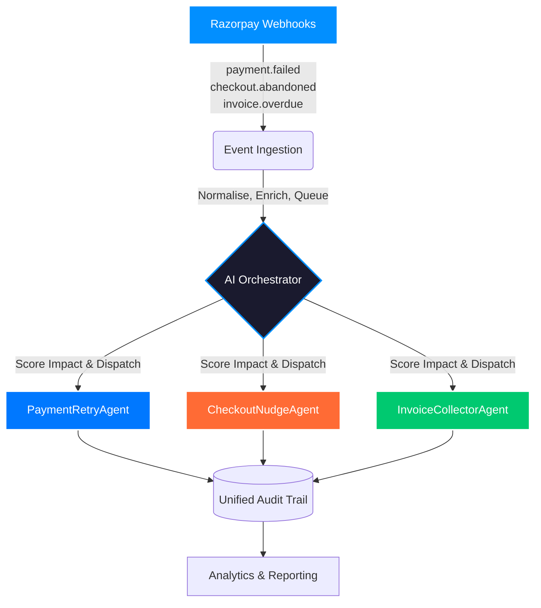

<div align="center">


# RevenueRadar

**Multi-Agent AI Revenue Recovery System**

<p align="center">
  <a href="#how-it-works">How it works</a> •
  <a href="#architecture">Architecture</a> •
  <a href="#tech-stack">Tech Stack</a> •
  <a href="#getting-started">Getting Started</a>
</p>

[](https://razorpay.com/buildathon/)
[](https://github.com/abhishekck31/RevenueRadar)
[](https://opensource.org/licenses/MIT)

*Revenue doesn't just vanish in one step — it **leaks**. A payment degrades, a checkout gets abandoned, an invoice goes overdue. RevenueRadar watches all three surfaces simultaneously, scores every leak by rupee impact, and dispatches the right recovery agent automatically.*

</div>

---

## ⚡ The Three Surfaces

Most recovery tools solve one problem. **RevenueRadar solves all three.**

| Surface | The Problem | The Agent |
| :--- | :--- | :--- |
| 💳 **Failed Payments** | Subscriptions degrading silently due to temporary card issues or network errors. | `PaymentRetryAgent` |
| 🛒 **Abandoned Checkouts** | 60–70% of users drop off before completing the payment process. | `CheckoutNudgeAgent` |
| 📄 **Overdue Invoices** | B2B payments sitting unpaid for weeks, affecting cash flow. | `InvoiceCollectorAgent` |

---

## 🧠 How It Works

1. **Detect**: Webhooks stream every `payment.failed`, `checkout.abandoned`, and `invoice.overdue` event into the ingestion layer.
2. **Triage**: The **AI Orchestrator** scores each event based on rupee value at risk, recovery probability, and time sensitivity. High-impact events are prioritized.
3. **Dispatch**: The appropriate sub-agent deploys with strictly bounded permissions (max retries, cooldown windows, human escalation triggers).
4. **Recover**: Agents execute context-aware recovery workflows via Razorpay test-mode APIs.
5. **Audit**: Every single decision is logged into a Unified Audit Trail (detected → triaged → acted → outcome).

---

## 🏗️ Architecture



---

## 🛠️ Tech Stack

- **Runtime Environment:** [Node.js](https://nodejs.org/)
- **Job Scheduling & Queues:** [BullMQ](https://docs.bullmq.io/) backed by [Redis](https://redis.io/)
- **Webhook Server:** [Express.js](https://expressjs.com/)
- **AI Orchestrator:** Claude API (`claude-3-5-sonnet-20241022`)
- **Payments Integration:** [Razorpay Test-Mode APIs](https://razorpay.com/docs/api/)
- **Audit Data Store:** [PostgreSQL](https://www.postgresql.org/)

---

## 🚀 Getting Started

### Prerequisites

- Node.js (v18 or higher)
- Redis Server running locally or via Docker
- PostgreSQL database
- Razorpay Test Mode Account
- Anthropic API Key

### Installation

1. **Clone the repository**
   ```bash
   git clone https://github.com/abhishekck31/revenue-radar.git
   cd revenue-radar
   ```

2. **Install dependencies**
   ```bash
   npm install
   ```

3. **Configure environment variables**
   ```bash
   cp .env.example .env
   ```
   *Edit `.env` and add your `RAZORPAY_KEY_ID`, `RAZORPAY_KEY_SECRET`, and `ANTHROPIC_API_KEY`.*

4. **Start the services**
   ```bash
   # Ensure Redis and Postgres are running, then:
   npm run dev
   ```

---

## 🔐 Safety & Bounds

RevenueRadar is built with strict guardrails to prevent accidental charges or customer spam:

- **Max 3 retries** per failed payment, employing exponential backoff.
- **Cooldown periods** enforced between checkout nudges.
- **Confidence thresholds** built into the AI logic; low-confidence scenarios always escalate to a human operator.
- **No double-charging** safeguards on every payment action.
- **Full audit logs** recorded before any action executes.

---

<div align="center">
  <p><sub>Most tools solve one leak. <b>RevenueRadar maps the whole pipe.</b></sub></p>
  <p>
    <a href="https://github.com/abhishekck31/RevenueRadar/issues">Report Bug</a>
    ·
    <a href="https://github.com/abhishekck31/RevenueRadar/issues">Request Feature</a>
  </p>
</div>